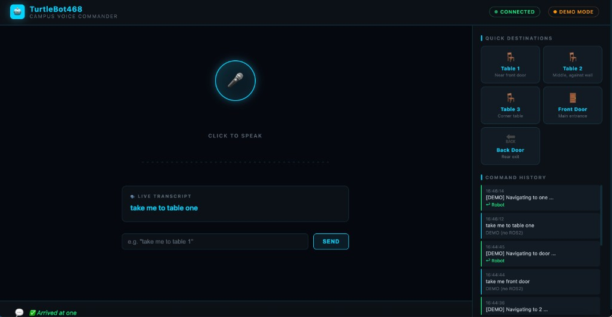

# TurtleBot468 — Speech Web Commander

A browser-based voice control interface for **TurtleBot468**.  
Speak a destination (e.g. *"take me to table 1"*) → speech is converted to text → sent to the ROS 2 navigation stack → robot drives to the location.



---

## How It Works

```
You speak  ──►  Web Speech API (browser)
                      │
                      ▼  WebSocket
              FastAPI Server (speech_server.py)
                      │
                      ▼  ROS 2 topic /user_input
              LLM Planner Node  (llm_planner_node.py)
                      │
                      ▼  /tool_cmd
              Task Executor Node (task_executor_node.py)
                      │
                      ▼  Nav2 Action
              TurtleBot468 Hardware
                      │
                      ▼  /robot_reply → WebSocket → Browser
              Status shown in UI
```

---

## Project Structure

```
speech_web_ui/
├── speech_server.py     # FastAPI + WebSocket bridge; publishes to ROS 2
├── static/
│   └── index.html       # All-in-one dark HUD frontend
├── run.sh               # One-shot launch script
├── requirements.txt     # Python dependencies (FastAPI, uvicorn)
├── screenshot.png       # UI preview
└── README.md
```

---

## Requirements

| Requirement | Version |
|-------------|---------|
| Python | 3.10 + |
| Browser | Chrome or Edge (required for Web Speech API) |
| ROS 2 | Humble / Iron *(only for real robot mode)* |

---

## Installation

### 1. Clone the repo (if you haven't already)

```bash
git clone https://github.com/En-PingSu/CS5335TurtleBot.git
cd CS5335TurtleBot/speech_web_ui
```

### 2. Create a Python virtual environment

```bash
python3 -m venv .venv
source .venv/bin/activate          # macOS / Linux
# .venv\Scripts\activate           # Windows
```

### 3. Install Python dependencies

```bash
pip install -r requirements.txt
```

---

## Running the Server

### Mode A — Demo Mode (no robot needed, for local testing)

```bash
./run.sh
# or manually:
python speech_server.py --port 8888
```

Open your browser at **http://localhost:8888**

In demo mode the server simulates the robot:
- ~1.5 s after sending a command → shows *"[DEMO] Navigating to …"*
- ~3 s later → shows *"✅ Arrived"*

The **orange `DEMO MODE`** badge in the top-right confirms no ROS 2 is connected.

---

### Mode B — Real Robot Mode (ROS 2 connected)

Make sure:
1. The TurtleBot468 ROS 2 stack is running (`llm_planner` + `task_executor` nodes active)
2. Your laptop is connected to the same Discovery Server as the robot

```bash
# Source ROS 2 first (the script does this automatically if found)
./run.sh --ros
```

The script automatically sets the required DDS environment variables:

```bash
RMW_IMPLEMENTATION=rmw_fastrtps_cpp
ROS_DISCOVERY_SERVER=192.168.50.31:11811
FASTRTPS_DEFAULT_PROFILES_FILE=~/.ros/super_client_configuration_file.xml
```

Once connected, the **orange `DEMO MODE`** badge disappears and commands are published directly to the `/user_input` ROS 2 topic.

---

## Connecting to TurtleBot468 (ROS 2 Setup)

### Prerequisites on the laptop

```bash
# 1. Source ROS 2
source /opt/ros/humble/setup.bash

# 2. Source workspace overlay
source ~/CS5335TurtleBot/install/setup.bash

# 3. Set DDS to use the robot's Discovery Server
export RMW_IMPLEMENTATION=rmw_fastrtps_cpp
export ROS_DISCOVERY_SERVER=192.168.50.31:11811
export FASTRTPS_DEFAULT_PROFILES_FILE=~/.ros/super_client_configuration_file.xml
```

### Verify the connection

```bash
ros2 topic list | grep turtlebot468
# Should show: /turtlebot468/amcl_pose, /turtlebot468/cmd_vel, etc.
```

### Start the ROS 2 nodes (if not already running)

```bash
# Terminal 1 — launch full Nav2 + LLM stack
ros2 launch campus_nav_llm navigation_mode.launch.py

# Terminal 2 — activate lifecycle nodes (first time only)
./activate_all.sh

# Terminal 3 — start speech web server
cd speech_web_ui
./run.sh --ros
```

---

## Using the UI

| UI Element | Action |
|------------|--------|
| **🎤 Mic button** | Click to start listening; click again to stop |
| **Live waveform** | Animates while microphone is active |
| **Live Transcript** | Shows recognized speech in real time (grey = interim, cyan = final) |
| **Quick Destination cards** | Click any card to instantly send that navigation command |
| **Manual input box** | Type a command and press **Enter** or **Send** |
| **Bottom reply bar** | Displays the robot's latest status message |
| **Command History** | Right panel logs every command sent and robot reply |

### Example voice commands

- *"Take me to table 1"*
- *"Go to the front door"*
- *"Take me to the back door"*
- *"Navigate to table 3"*

The LLM planner also understands aliases like *"desk 1"*, *"corner table"*, *"exit"*, etc.

---

## Available Locations

| Name | Aliases | Description |
|------|---------|-------------|
| `table_1` | desk 1, first table, table near door | Near the front entrance |
| `table_2` | desk 2, middle table, second table | Against the wall, middle |
| `table_3` | desk 3, corner table, third table | Back corner of room |
| `front_door` | entrance, main door, front entrance | Main classroom entrance |
| `back_door` | rear door, exit, back entrance | Rear exit |

---

## Troubleshooting

| Symptom | Fix |
|---------|-----|
| Mic button does nothing | Use Chrome or Edge; Safari does not support `SpeechRecognition` |
| Browser asks for mic permission | Click **Allow** in the browser popup |
| `DEMO MODE` badge stays orange | Start server with `./run.sh --ros` and verify ROS 2 is sourced |
| WebSocket shows `Disconnected` | Refresh the page; server auto-reconnects every 3 s |
| Robot does not move | Check that `llm_planner` and `task_executor` nodes are running: `ros2 node list` |
| Clock offset warning in logs | Run `./check_clock_offset.sh` to diagnose RPi4 / Create3 time drift |

---

## License

CS 5335 Robotics Science — Northeastern University, 2026
